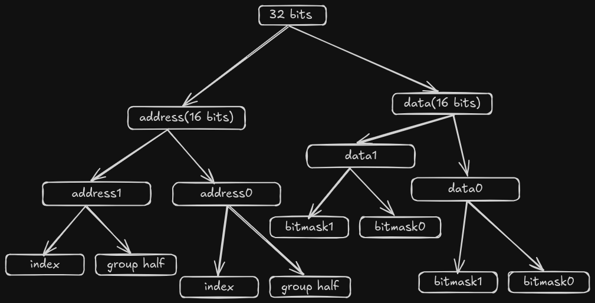

This document explains the working of the flight plan v2.0 for the Gimbal project. This flight plan is structured in according to an actor model. An Actor is an entity that interacts with other actors purely through asynchronous events (like signals). In our program, an actor is materialized through a process that is forked from an initial process.
### Code Principles
---
#### Types of Actors
---
The three types of actors in our system are the Parent, States and Readers. Readers are actors that concurrently read multiple inputs across the satellite and report changes to the parent. States are actors that represent various modes in the state table and Parent is the Actor that controls all the States.
##### Parent
This process controls all the other processes. Communication between other processes is strictly through signals. The reader actors signal the parent process a change in the input mask, along with the modifications to be done to the input mask. The parent process then updates the input mask and uses it to decide the next state (based on a state table).
##### Readers
A reader actor is a process that reads a specific input. The reader sends signals to the parent whenever there is a change in the input (based on certain thresholds). In the Gimbal project we have only a single reader, which checks the input from the antenna using the SPI communication protocol.
##### States
A state actor represents a mode in the flight plan. A mode represents the set of instructions that the satellite must perform under certain conditions. In the Gimbal project we have two states, which represent the stationary and rotatory modes. The modes are described as follows:
- Stationary mode: This mode indicates that the satellite must have a fixed orientation.
- Rotatory mode: This mode indicates that the satellite must have a constant angular velocity.
#### State Table
---
The decision to switch to the next mode is taken by the parent based on the state table. The state table consists of multiple rows containing the current state, inputs (represented through an input bitmask) and the next state.
##### Input Bitmask
The input bitmask consists of an array of cells. Each cell can either be a 0, 1 or X (Don't care). This array is used by the parent to switch to the next state. For example, let a machine be in state A, which will switch to state B if its input mask is of the form 1X0X. Now, if our current inputs were represented by 1100, 1101, 1001 or 1000, then we would switch to state B. To implement the X symbol, we use 2 binary bitmasks. These are named bitmask1 and bitmask0. All the X are replaced by 1 in bitmask1 and by 0 in bitmask0. Then in order to check for equality between our input and the input mask, we use the formula : `(AB + A'C')'` , where
- A represents the inputs as a binary bitmask
- B is bitmask1 and'
- C is bitmask0.
In the example given above, 1X0X is represented by
- bitmask1 = 1101 and
- bitmask0 = 1000
Now if our input is A = 1100, 1101, 1001 or 1000, then the value of `(AB + A'C')'` will be `0`
The following table represents the state table for the Gimbal project (LSB signifies SPI input).

| Current State | Input Bitmask | Next State |
| ------------- | ------------- | ---------- |
| Stationary    | xxx0          | Stationary |
| Stationary    | xxx1          | Rotatory   |
| Rotatory      | xxx0          | Rotatory   |
| Rotatory      | xxx1          | Stationary |
#### Mode switching
Mode switching occurs when a reader sends a signal to the parent (along with the changes in the inputs). The signal API of the Linux Kernel allows us to send a maximum of 32 bits of information. If we send the input bitmask directly through this API, then we will have to limit our input bitmask to 16 bits (16 bits to send bitmask1 and 16 bits to send bitmask0). Since we anticipate that we will require more than 16 bits for the input bitmask, an address based mechanism was devised. In this mechanism we divide the 32 bits into two halves: address half and data half. These are further divided as follows

### Code Documentation

---

#### **Includes**
```c
#include <fcntl.h>
#include <linux/spi/spidev.h>
#include <signal.h>
#include <stdint.h>
#include <stdio.h>
#include <stdlib.h>
#include <sys/ioctl.h>
#include <sys/wait.h>
#include <unistd.h>
```
- **fcntl.h**: Provides file control options, such as manipulating file descriptors.
- **spidev.h**: For SPI (Serial Peripheral Interface) communication.
- **signal.h**: For signal handling in Unix-based systems.
- **stdint.h**: For fixed-width integer types.
- **stdio.h**: Standard input/output functions (e.g., `printf`).
- **stdlib.h**: For general utility functions, such as dynamic memory allocation.
- **sys/ioctl.h**: For device-specific input/output operations.
- **sys/wait.h**: Provides the `wait` function to wait for processes to change state.
- **unistd.h**: Provides access to POSIX operating system API, such as `fork`, `pipe`, and `exec`.

---

#### **Macro Definitions**
```c
#define NO_OF_GROUPS 2
#define SIG_P2C 1
#define SPI_PATH "/dev/spidev0.1"
```
- **NO_OF_GROUPS**: Defines the number of groups, set to 2, likely used to organize input or data processing.
- **SIG_P2C**: Defines a signal for inter-process communication (from Parent to Child).
- **SPI_PATH**: Defines the path to the SPI device on the system (`/dev/spidev0.1`).

---

#### **Global Variables**
```c
int spi_id;
int flag = 0;
uint16_t out_sensor[3];
uint16_t out_kalman[3];
int duty_cycle;
int fd;
```
- **spi_id**: Holds the ID or file descriptor for the SPI communication device.
- **flag**: Used to trigger or track specific events (set when a signal is received).
- **out_sensor**: Stores the output from sensors (3 sensor values).
- **out_kalman**: Stores the Kalman filter output (3 processed values).
- **duty_cycle**: Holds the value for the PWM (Pulse Width Modulation) duty cycle.
- **fd**: File descriptor used for accessing devices (e.g., SPI).

---

#### **Function Definitions**

1. **Kalman Filters**
```c
void kalmanfilterR(uint16_t *buf, uint16_t *buf2) { return; }
void kalmanfilterS(uint16_t *buf, uint16_t *buf2) { return; }
```
- Placeholder functions for Kalman filters.
- **kalmanfilterR**: Processes input `buf` and updates `buf2` (no implementation provided).
- **kalmanfilterS**: Similar to `kalmanfilterR`.

2. **PID Controller**
```c
int pid(uint16_t *buf2) { return 0; }
```
- A placeholder function for a PID (Proportional-Integral-Derivative) controller that accepts sensor data (`buf2`).
- It currently returns 0 but would typically calculate a control value.

3. **PWM Control**
```c
int pwm(int duty_cycle) { return 0; }
```
- A placeholder function to set the duty cycle for a PWM signal. It currently returns 0.

---

#### **State Machine Structures**
```c
typedef struct {
    pid_t pid;
    struct row *head;
    int length;
} state;

struct row {
    uint8_t bitmask1[NO_OF_GROUPS];
    uint8_t bitmask0[NO_OF_GROUPS];
    state *next_state;
};
```
- **state**: Represents a state in the state machine with:
  - **pid**: Process ID.
  - **head**: Pointer to the first row in the state's row list.
  - **length**: Number of rows in the state.

- **row**: Represents a row in the state table with:
  - **bitmask1**: Bitmask for active bits in group 1.
  - **bitmask0**: Bitmask for active bits in group 0.
  - **next_state**: Pointer to the next state in the machine.

---

#### **Global Arrays for Input and States**
```c
uint8_t input_mask[2] = {0x00, 0x00};
uint8_t clear_mask[2] = {0xFF, 0xF0};
row stat_rows[2];
row rot_rows[2];
state stationary_state = {0, stat_rows, 2};
state rotate_state = {0, rot_rows, 2};
state *current_state;
state *next_state;
```
- **input_mask**: Represents the current input mask with two 8-bit values.
- **clear_mask**: A mask used to clear or reset certain inputs.
- **stat_rows**: Rows defining the stationary state state table.
- **rot_rows**: Rows defining the rotating state state table.
- **stationary_state**: Defines the stationary state and links it to `stat_rows`.
- **rotate_state**: Defines the rotating state and links it to `rot_rows`.
- **current_state**: Pointer to the active state in the state machine.
- **next_state**: Pointer to the next state to transition to.

---

#### **Row and Mode Initialization**

1. **Add Row Function**
```c
int add_row(row *head, uint8_t bitmask1, uint8_t bitmask0, int group_no, state *next_state) {
    static int index;
    head[index / NO_OF_GROUPS].bitmask1[group_no] = bitmask1;
    head[index / NO_OF_GROUPS].bitmask0[group_no] = bitmask0;
    head[index++ / NO_OF_GROUPS].next_state = next_state;
    return 0;
}
```
- Adds a row to the specified `head` (either stationary or rotating).
- Sets the `bitmask1`, `bitmask0`, and the `next_state` for the row.

2. **Initialize Modes**
```c
int init_modes() {
    add_row(stat_rows, 0xEE, 0x01, 0, &rotate_state);
    add_row(stat_rows, 0xEE, 0x00, 1, &rotate_state);
    add_row(rot_rows, 0xEE, 0x01, 0, &stationary_state);
    add_row(rot_rows, 0xEE, 0x00, 1, &stationary_state);
    return 0;
}
```
- Initializes the state machine modes by setting up transition rows for both stationary and rotating states.

---

#### **Input Mask Comparison**
```c
int compare_input_mask(uint8_t inputmask[], row row) {
        for (int i = 0; i < NO_OF_GROUPS; i++) {
                if (~((inputmask[i] & row.bitmask1[i]) | (~inputmask[i] & ~row.bitmask0[i]))) {
                        return 0;
                }
        }
        return 1;
}}
```
- Compares the input mask against the provided row's bitmask and returns `1` if they match, otherwise `0`.

---

#### **Signal Handlers**

1. **Stop Signal Handler**
```c
void sigstophandler(int signo, siginfo_t *info, void *context) {
    if (signo == SIGTSTP) {
        if (info->si_value.sival_int == SIG_P2C) {
            flag = 1;
        }
    }
}
```
- Handles `SIGTSTP` (stop signal), setting a `flag` if the signal value matches `SIG_P2C`.

2. **User Signal Handler**
```c
void sigusrhandler(int signo, siginfo_t *info, void *context) {
    uint32_t sigv = info->si_value.sival_int;
    ...
}
```
 - This function is called when a SIGUSR1 signal is received. It processes the signal value to extract
  the addresses and bitmasks. These are used to modify the input mask. The function then iterates over
  the current state's rows to find a match with the input mask. If a match is found, the next state is set.
  If the next state is different from the current state, the current state's process is stopped and the
  next state's process is continued.


